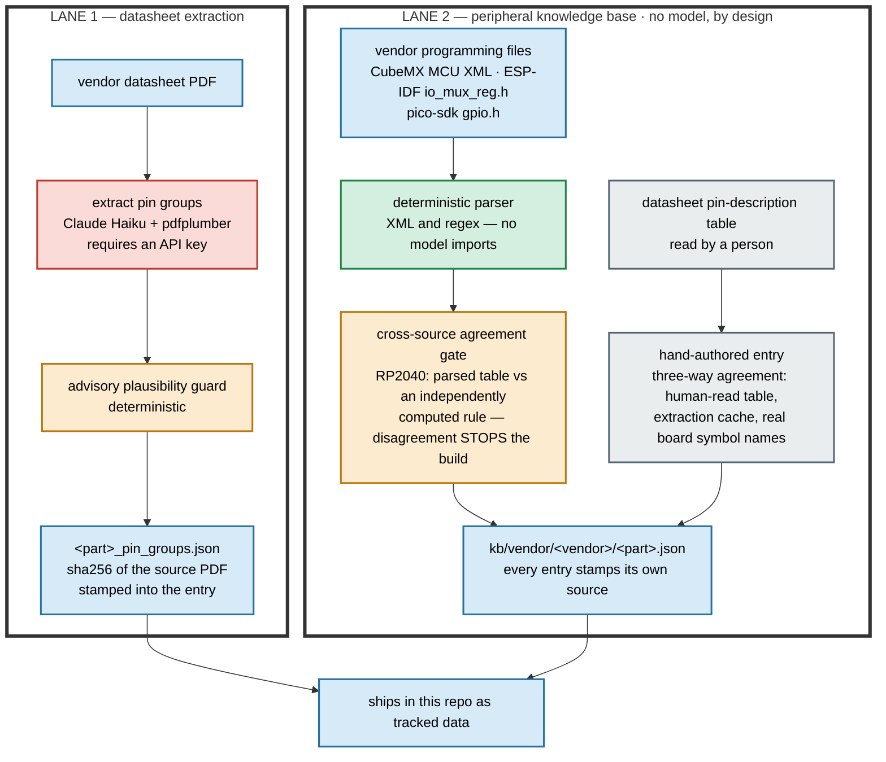
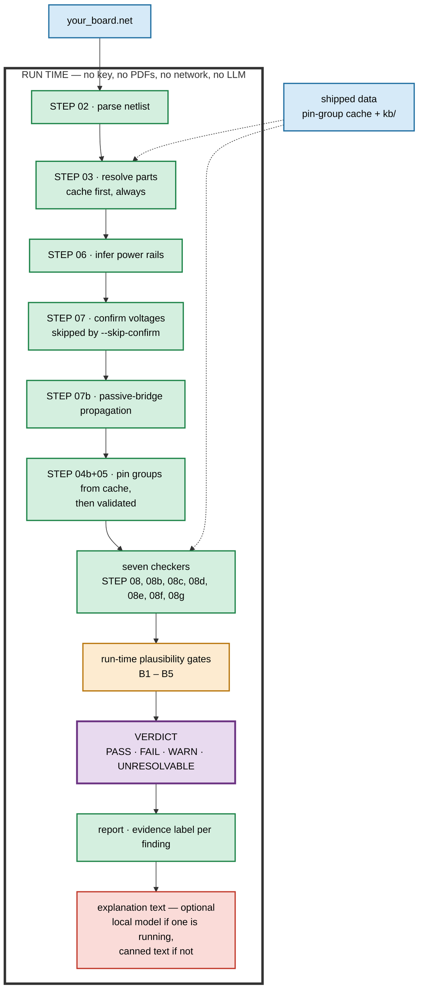
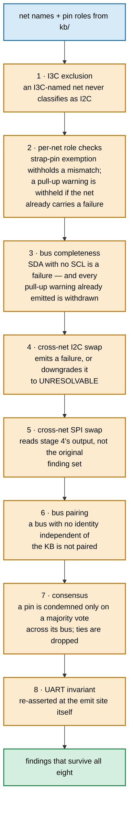

# DeepERC — pipeline architecture

> Verified by hand against the code at checker era `4c0b3b89`, cache version
> `2026-08-15+852cfb49d06a`. If this document and the code disagree, the code
> is right.

The [README](../README.md) carries a two-lane summary. This is the same
architecture with the detail left in: what ships as data and what makes it,
what happens on your machine, where the deterministic gates sit, how the
peripheral checker actually reaches a verdict, and what the evidence label on
a finding is measuring.

Three claims this document exists to make checkable:

1. A run on your machine makes **no LLM calls, needs no API key, and makes no
   outbound network calls.**
2. An LLM sits **upstream of the cache and downstream of the verdict** — never
   between your netlist and a verdict.
3. The **evidence label is a measurement**, not a formatting choice.

---

## What ships as data, and what made it

Two independent build lanes run offline, before you ever clone this repo.
Their outputs ship; the tools that produce them do not.



**Colour:** red is an LLM, green deterministic code, amber a deterministic
gate, grey a human step, blue data.

**Lane 2 has no red box, and that is deliberate rather than incidental.** The
knowledge base drives verdicts directly: both failures in the README demo are
KB-derived, with no datasheet involved at all. That makes it the one place
where a model authoring the data would be most tempting and most damaging — a
wrong pin role in `kb/` becomes a wrong verdict, with nothing downstream to
catch it.

The upstream defects in [FINDINGS.md](../FINDINGS.md) arrived by three different
routes: one from the knowledge base alone, one from a supply check against a
datasheet-derived rating, and one from pin-function evidence on a part the
knowledge base had never seen. No single lane carries the tool. Entries come either from
machine-readable vendor files parsed deterministically, or from a person
reading a datasheet's pin table directly. Hand-authored entries record that in
the shipped file, and say plainly that they were **not** derived from the
extraction cache or from any PDF read by a model.

Both lanes' tools are excluded from the public tree. You receive their output,
and every entry carries enough provenance to say where it came from.

Jump to: [the KB in detail](#the-knowledge-base-lane) ·
[what a run does not do](#what-a-run-does-not-do)

---

## What happens on your machine



Note where the one red box is: **after** the verdict. It rewrites a finding's
prose and cannot change its status. If no local model is running, findings
carry canned text instead and the verdict is identical.

**The step numbers are the `[STEP nn]` lines a run prints,** shown in the order
they execute. The numbering is historical, not sequential: `04b+05` runs
*after* `07b`, because rail inference has to filter supply pins before
extraction, and passive-bridge propagation has to land before the signal
checker sees driver rails.

`[STEP 05]` and `[STEP 10]` are not progress tags, and neither appears on a
clean run. Each is conditional: `[STEP 05]` prints when a validation gate
fires, and `[STEP 10]` prints when a finding needed explanation text and no
local model was running —

```
[STEP 10] explanation text unavailable (local LLM not running) — verdicts unaffected
```

which is the optional explanation step saying so on your screen. The
report-written line is logged below the default threshold and does not print.

Jump to: [the seven checkers](#the-seven-checkers) ·
[inside STEP 08d](#inside-step-08d--why-one-box-is-not-one-check) ·
[the run-time gates](#the-run-time-plausibility-gates) ·
[the evidence label](#what-the-evidence-label-measures)

---

## What a run does not do

| Absent path | Why |
|---|---|
| Digi-Key / Nexar vendor lookup | Not in the public tree at all — the L2 resolver modules are excluded from the shipped file set. `[STEP 03] L2 vendor lookup: off` prints on every run. |
| Local LLM extraction (`gemma_mineru`) | Registered but dormant. Selected only by an explicit `SCHECKER_EXTRACTOR=gemma_mineru` override, and even then only on a cache miss with a PDF present. |
| Cloud extraction (`haiku_pdfplumber`) | Reached only on a **cache miss**. With a warm cache — the shipped demo, and any board whose parts you have already extracted — it is never invoked. Without an API key it returns before any network call. |
| KB authoring | Both lanes are offline and excluded from this release. Nothing in the check path writes `kb/`. |
| Datasheet download (`download_datasheets.py`) | Ships as a standalone command-line tool. Nothing in the check path imports it. Running it is a deliberate, separate act. |

---

## The knowledge base lane

`kb/` ships as tracked data: eleven part entries under `kb/vendor/`, loaded
once per process and consumed by two checkers — the peripheral checker
(`[STEP 08d]`) and the pull-up presence checker (`[STEP 08g]`), which reuses
the peripheral checker's own classification gate rather than guessing from net
names.

Entries come from one of two lanes, and each entry records which:

| | Lane 2a — vendor files | Lane 2b — hand-authored |
|---|---|---|
| Source | CubeMX MCU XML, ESP-IDF `io_mux_reg.h`, pico-sdk `gpio.h` | The vendor datasheet's own pin-description table, read by a person |
| Produced by | `tools/build_kb.py` — XML and regex parsing, no network or model imports | No tool. Written directly, deliberately. |
| Covers | MCU families, where pin function tables are machine-readable | Fixed-function parts: sensors, I/O expanders, chargers, EEPROMs |
| Stamped as | `kb_source` + `kb_version` + extraction timestamp | A `provenance` block naming the source, the checks performed, and the date |
| Gate | RP2040: the parsed table is checked against an independently computed rule; any disagreement raises and stops the build | A three-way agreement: the human-read table, the extraction cache, and a real board's KiCad symbol pin names must all agree |

The hand-authored lane exists because automating it would mean having a model
read a datasheet PDF to produce data that drives verdicts — which is precisely
the practice this project refuses. Six parts is a tractable amount of careful
manual work; a pipeline that quietly reintroduced model-derived pin identity
would not be worth the time it saved.

At load time the loader validates every entry and raises on a missing part
name, a missing pin list, or a strap definition without a datasheet reference.
The pipeline catches that failure rather than aborting: it prints
`[STEP 08d] WARNING: Peripheral KB unavailable (…); I2C checks disabled` and
continues with an empty knowledge base. That is a deliberate trade for the
common case — a `kb/` directory that isn't where the run expected it, usually
a wrong working directory — but it has a consequence worth stating precisely.

The peripheral checker still runs. Its detection paths divide on whether they
need a curated part entry, and only those go quiet: protocol and instance
mismatches, the consensus vote across a part's pins, and the UART invariant
all stop firing, because there is no part entry left to compare against. What
survives is the evidence the netlist carries on its own face — a pin literally
named `SDA`, `SCL`, `MOSI` or `MISO` still contradicts the bus it is wired to.
That path is how the third defect in [FINDINGS.md](../FINDINGS.md) was found, on a
part the knowledge base had never seen.

So a failed load leaves the bucket **thinner, not empty** — and a thin
peripheral bucket is indistinguishable from a clean one at a glance. If you
see that warning, read the peripheral counts as partial.

Per-pin provenance survives into the report where there is provenance to
carry: a finding resting on a curated part entry names the source class of
that entry. A finding resting on pin-function evidence alone carries no such
stamp, because no knowledge-base entry stands behind it — its grounds are in
the evidence text instead.

---

## The seven checkers

Each prints a progress line during the run, and appears again in the per-board
summary at the end.

| Tag | Bucket | Checks |
|---|---|---|
| `[STEP 08]` | `signal` | Driver voltage against receiver input threshold, per signal net |
| `[STEP 08b]` | `supply` | Each supply pin's rail against the part's rated range |
| `[STEP 08c]` | `structural` | Floating power, connectivity integrity |
| `[STEP 08d]` | `peripheral` | Pin-role and net-name coherence for I2C, SPI — [see below](#inside-step-08d--why-one-box-is-not-one-check) |
| `[STEP 08d]` | `peripheral` | UART: device-relative bus capability — a TX/RX signal landing on a KB-known pin with no UART capability (no net names consulted; no TX↔RX swap detection) |
| `[STEP 08e]` | `pullup_value` | I2C pull-up resistor value range |
| `[STEP 08f]` | `output_conflict` | Push-pull outputs shorted to one another |
| `[STEP 08g]` | `pullup_presence` | Missing pull-ups on open-drain, flash CS, SD families |

The report's `summary.pass`/`warn`/`fail`/`unresolvable` hoist only the
`signal` (`[STEP 08]`) bucket; `summary.total_pass`/`total_warn`/`total_fail`/
`total_unresolvable` (schema `poc-1.4`) sum across all seven buckets above.

---

## Inside `[STEP 08d]` — why one box is not one check

This is the checker behind the upstream defects in
[FINDINGS.md](../FINDINGS.md). It is not a single pass comparing a pin's role to
its net's name. It is eight ordered stages, and most of them exist to
**withhold** a finding rather than to emit one.



What this buys that a single-pass checker cannot have: corroborating a bus's
identity across nets, requiring more than one voter before condemning a pin,
suppressing a weaker finding behind a stronger one on the same net, and
withdrawing an earlier warning once a later stage proves the bus was
structurally incomplete all along.

Stages 6 and 7 are why a defective I2C bus can be flagged by comparing it
against a *correct* bus on the same board.

---

## The run-time plausibility gates

Extraction is not trusted because a model produced it. Every cached value
passes a deterministic check again, at use time, on every run.

| Gate | What it checks | Effect when it fires |
|---|---|---|
| B1 | A pin's input-high threshold equal to its absolute-maximum voltage — the signature of both values being read from the same table | Confidence and evidence label downgraded; verdict untouched |
| B2 | A supply range whose minimum equals its maximum — the signature of a typical value read as a range | Hard downgrade to **UNRESOLVABLE** |
| B3 | A converter's input rating that cannot be reconciled with the confirmed rail topology | Hard downgrade to **UNRESOLVABLE**, regardless of the prior verdict |
| B4 | A rated range that does not correspond to the pin's own rail name | Hard downgrade to **UNRESOLVABLE** |
| B5 | A driver that is not push-pull, or behaves as open-drain | Hard downgrade to **UNRESOLVABLE** |

B2 is worth dwelling on: the *same* check runs twice. At extraction time it is
advisory and only writes a log line. At use time it gates the verdict on every
board, every run. The cache is never treated as settled just because it was
validated once when it was written.

This is the project's core commitment made mechanical. A model proposes;
deterministic code disposes. When the deterministic code cannot dispose either
way, the result is `UNRESOLVABLE` — an honest "could not verify," never a
silent pass and never an invented failure.

---

## What the evidence label measures

Every finding carries a label saying where its data came from and whether it
was checked against a datasheet on your disk.

| Label | Meaning |
|---|---|
| `Confirmed — …` | A PDF is on your disk **right now** and its sha256 matches the hash stamped into the cache entry when it was built |
| `Cache-sourced — … (not locally verified)` | No PDF on disk. Nothing to compare against — so no claim is made |
| `Cache-sourced — … (local datasheet differs from cache source)` | A PDF is on disk and its sha256 does **not** match |
| `(MCU KB — no datasheet required)` | The finding came from the knowledge base or from netlist topology; no datasheet is involved |
| `(no part data in the cache — see LIMITATIONS.md to add parts)` | The part was never cached |

The first three are the outcome of a comparison performed on each run: the
sha256 stored in the cache entry against a freshly computed sha256 of the file
currently on disk. A size mismatch short-circuits to "differs" without hashing.

The consequence worth understanding: **a finding can change label between two
runs with the cache file untouched**, because the vendor re-rendered the PDF
you downloaded. That is the label doing its job. It is reporting a
measurement, not repeating something recorded at build time.

The two `Cache-sourced` labels are not weaker verdicts. The verdict is the same
either way. They are statements about what was checkable, and they are the
reason the shipped demo can run with no datasheets on disk at all without
pretending to a confidence it has not earned.
